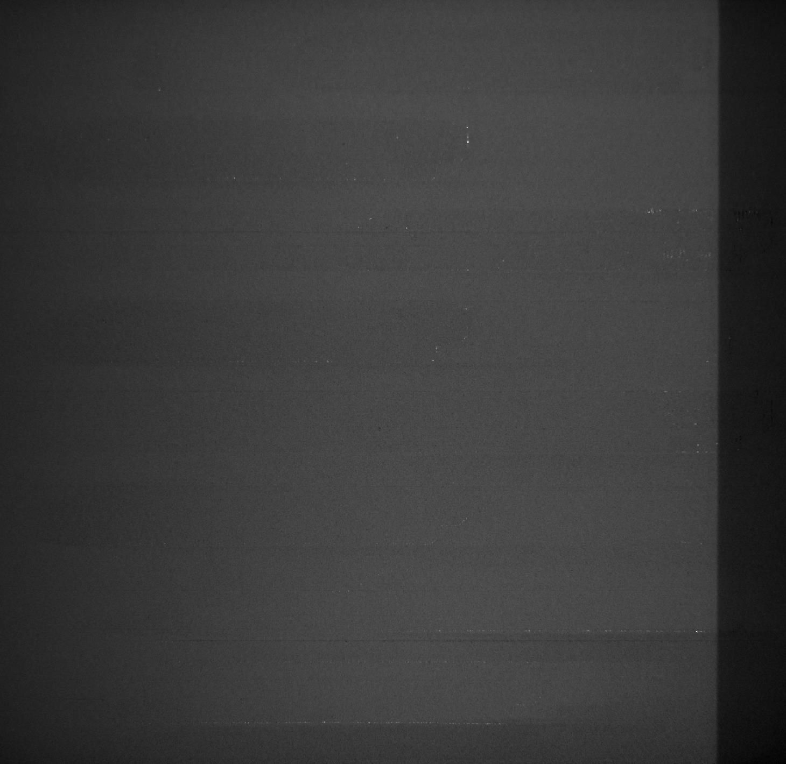
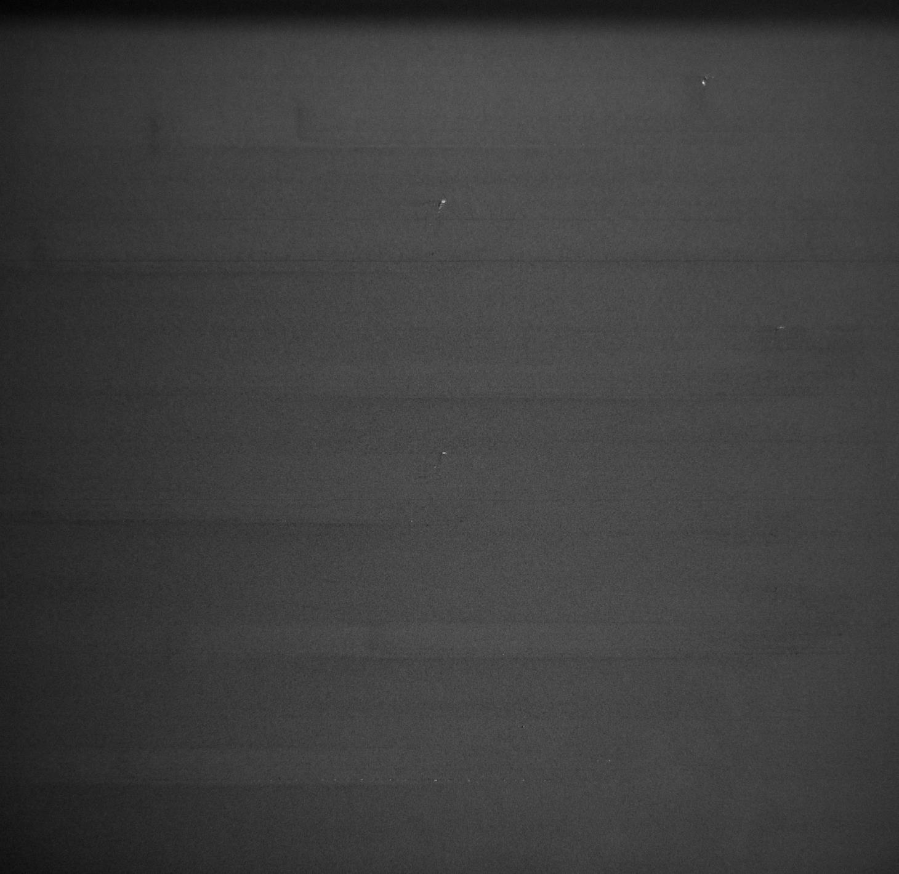
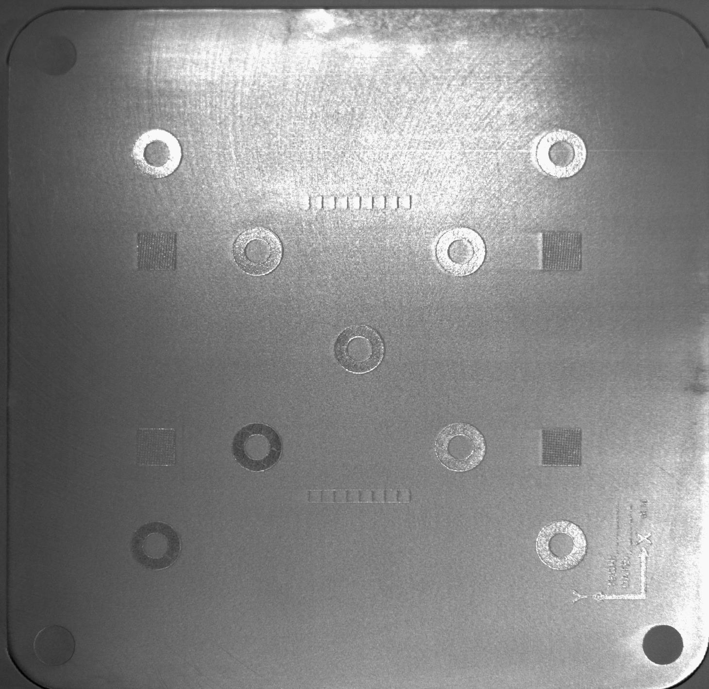
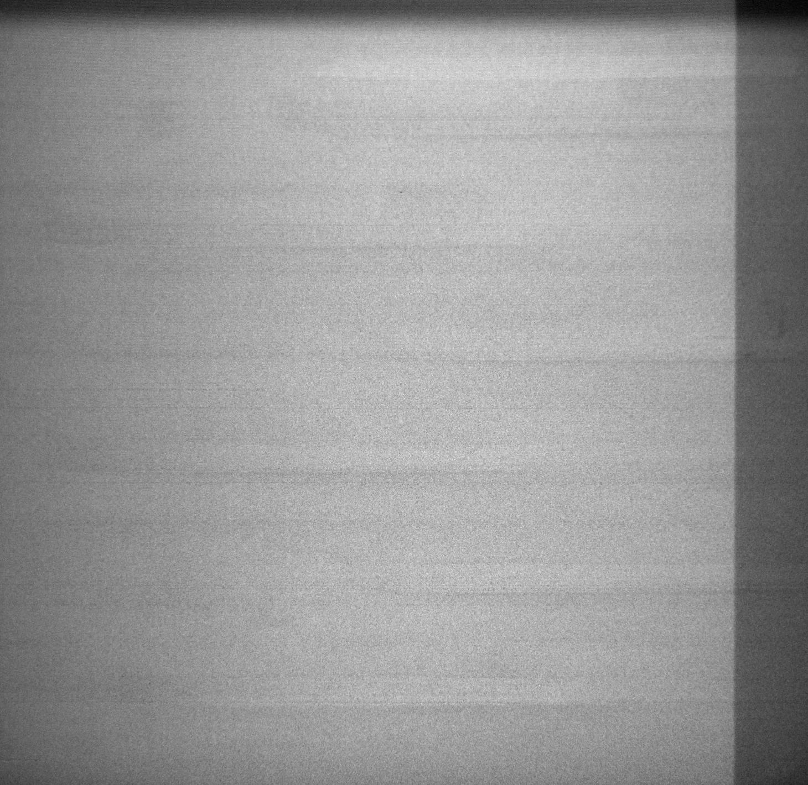
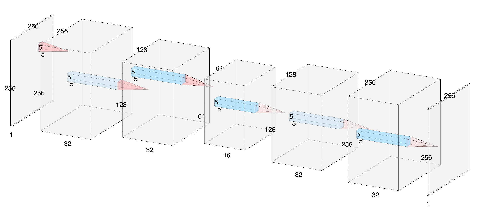

# 3d_printing_defect_detection

## Goal
Build a deep-learning algorithm for detecting defective layers of a 3D-printed detail. 

<table>
  <thead>
    <tr>
      <td>Good layer</td>
      <td>Defective layer</td>
    </tr>
  </thead>
  <tbody>
    <tr>
      <td></td>
      <td></td>
    </tr>
  </tbody>
</table>

## Data overview
The data was available for 3 printing machines, however only one machine was used for building the MVP and testing the approach. Major data properties:

* 44763 images of printed layers, both good and defective
* No labeleing for the images - prior to the MVP it was unknown which layers should be considered defective
* Layers are not consistent - specific "groups" of laeyrs could be defined based on the similar look

<table>
  <thead>
    <tr>
      <td>Group 1</td>
      <td>Group 2</td>
      <td>...</td>
    </tr>
  </thead>
  <tbody>
    <tr>
      <td></td>
      <td></td>
      <td>...</td>
    </tr>
  </tbody>
</table>

* Prior to the training the manual expection of part of the images was done, to identify at least some defective images for validation purposes
* Final training set: 43260 images
* Test set:
  - Holdout: 2277 images
  - Defective: 126 images
  
## Solution
### Neural network
The core of the solution is a Convolutionla Autoencoder with some logic applied above it for anomaly scoring.
 
Neural network architecute (drawn using <a href="http://alexlenail.me/NN-SVG/LeNet.html">this</a> tool):


Same in code:
```python
#Random seed
np.random.seed(42)

# Network architecture
input_image_cnn = Input(shape=(256, 256, 1))

# Encoding
encoded_cnn = Conv2D(32, (5, 5), activation='relu', padding='same')(input_image_cnn)
encoded_cnn = MaxPooling2D((2, 2), padding='same')(encoded_cnn)

encoded_cnn = Conv2D(32, (5, 5), activation='relu', padding='same')(encoded_cnn)
encoded_cnn = MaxPooling2D((2, 2), padding='same')(encoded_cnn)

encoded_cnn = Conv2D(16, (5, 5), activation='relu', padding='same')(encoded_cnn)
encoded_cnn = MaxPooling2D((2, 2), padding='same')(encoded_cnn)


# Decoding
decoded_cnn = Conv2D(16, (5, 5), activation='relu', padding='same')(encoded_cnn)
decoded_cnn = UpSampling2D((2, 2))(decoded_cnn)

decoded_cnn = Conv2D(32, (5, 5), activation='relu', padding='same')(decoded_cnn)
decoded_cnn = UpSampling2D((2, 2))(decoded_cnn)

decoded_cnn = Conv2D(32, (5, 5), activation='relu', padding='same')(decoded_cnn)
decoded_cnn = UpSampling2D((2, 2))(decoded_cnn)

decoded_cnn = Conv2D(1, (5, 5), activation='sigmoid', padding='same')(decoded_cnn)
```

### Anomaly logic
Once the image was processed throw the NN, meaning a reconstructed one is produced, the Euclidian distance between the input image and the reconstructed one is calculated. Once the disctance value is known, it is tested agains a thershold. To identify the proper threshold value, the following approach was used:
* Calculate the mean of Euclidian distance for the holdout test set
* Calculate the mean of Euclidian distance for the defective images test set
* Evaluate various threshhold between these to values to get the best F1 score
```python
for threshold in range(1570,1640,5):
    total_diff_holdout = []
    anomalies_holdout = []
    
    for i in range(data_256_holdout.shape[0]):
        diff_2 = np.linalg.norm(data_256_holdout[i, :, :, ]*255. - decoded_imgs_256_cnn_holdout[i]*255.)

        if diff_2 >= threshold:
            anomalies_holdout.append(1)

    FP = np.sum(anomalies_holdout)
    TN = data_256_holdout.shape[0] - FP

    total_diff_defect = []
    anomalies_defect = []
    for i in range(data_256_defect.shape[0]):
        diff_2 = np.linalg.norm(data_256_defect[i, :, :, ]*255. - decoded_imgs_256_cnn_defect[i]*255.)

        if diff_2 >= threshold:
            anomalies_defect.append(1)

    TP = np.sum(anomalies_defect)
    FN = data_256_defect.shape[0] - TP

    precision = TP/(TP+FP)
    recall = TP/(TP+FN)
    F1 = 2 * (precision*recall)/(precision+recall)

    print("Threshold: {0}".format(threshold))
    print("False positive: {0}".format(FP))
    print("True negative: {0}".format(TN))
    print("True positive: {0}".format(TP))
    print("False negative: {0}".format(FN))
    print("Precision: {0}".format(precision))
    print("Recall: {0}".format(recall))
    print("F1: {0}".format(F1))
    print("----------")
```

## Results
The major result is proving to the stakeholder that the approach is viable in general. However, confusion matrix for 1630 threshold is included.

<table>
  <thead>
    <tr>
      <td></td>
      <td>y_pred=1</td>
      <td>y_pred=0</td>
    </tr>
  </thead>
  <tbody>
    <tr>
      <td>y=1</td>
      <td>66</td>
      <td>60</td>
    </tr>
    <tr>
      <td>y=0</td>
      <td>1049</td>
      <td>1228</td>
    </tr>
  </tbody>
</table>

## Application
A simple web-application for demostration purposes. The main functionality is the ability to upload the images for analysis. As an input the user shall get the anomaly score (Euclidian distance), as well as 16 bottlneck filters representing the encoding of the image - this particular feature was added to see how NN "sees" the image.

## UI
A mocup of the UI for operating, once the solution is in production. The killer-feature is the interface for image labeling.

## Next steps and improvements
In order to improve the performance of the algorithm the following steps shall be visable:
* Move to supervised learning by labeling the data
* Devide the training data into layer "groups" and make a separate model for each
* Incorporate changes in architecture:
  - Dropouts
  - Regularization
  - Sequential layer analysis
  - TBD
